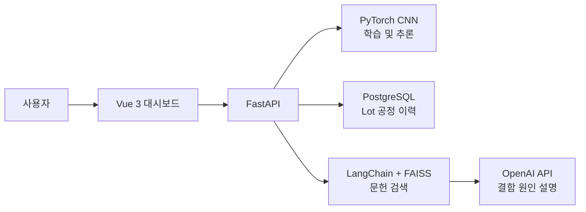

# WaferGuard

> CNN 기반 웨이퍼 결함 분류와 논문 기반 원인 분석을 결합한 MLOps 서비스

WaferGuard는 반도체 웨이퍼 맵을 분석해 결함 패턴을 분류하고, Lot별 공정 이력과 결함 통계를 제공합니다. 재학습한 모델과 기존 모델의 성능을 비교해 더 나은 모델을 반영하며, 결함률이 높은 Lot에는 관련 논문을 검색해 LLM 기반 원인 설명과 점검 항목을 제공합니다.

## 주요 기능

- 단일 웨이퍼 이미지의 결함 유형 및 신뢰도 예측
- 단일 Lot 및 다중 Lot 단위의 결함률·유형별 통계 분석
- PostgreSQL에 저장된 Lot별 공정 장비 및 레시피 이력 조회
- 라벨 데이터 업로드를 통한 기존 모델 성능 평가
- 모델 재학습 후 Macro F1 기준 기존 모델과 자동 비교·교체
- FAISS 문헌 검색과 OpenAI API를 활용한 결함 원인 및 점검 항목 설명

분류 대상은 `Center`, `Donut`, `Edge-Loc`, `Edge-Ring`, `Loc`, `Random`, `Scratch`, `Near-full`, `none`의 9개 클래스입니다.

## 시스템 아키텍처



## 기술 스택

| 영역 | 기술 |
| --- | --- |
| Frontend | Vue 3, Vite, Axios, Chart.js, Bootstrap |
| Backend | FastAPI, Pydantic, Uvicorn |
| ML | PyTorch, torchvision, scikit-learn, OpenCV |
| Database | PostgreSQL, psycopg2 |
| LLM/RAG | OpenAI API, LangChain, FAISS, PyMuPDF |

## 프로젝트 구조

```text
MLOps_wafer/
├── back/
│   ├── api/
│   │   └── routes/          # 예측, 재학습, LLM 설명 API
│   ├── config/              # 환경, 경로 및 DB 설정
│   ├── core/
│   │   ├── data/            # PyTorch 데이터셋
│   │   ├── evaluation/      # 평가지표 및 시각화
│   │   └── model/           # CNN 구조, 학습 및 추론
│   ├── model/               # 서비스에서 사용하는 모델 가중치
│   ├── paper/               # RAG 검색 대상 논문
│   ├── scripts/             # 문헌 인덱스 생성 스크립트
│   ├── services/            # PostgreSQL 및 LLM 서비스
│   ├── tests/               # 백엔드 테스트
│   ├── utils/               # 파일 및 이미지 공통 기능
│   ├── .env.example         # 환경변수 예시
│   ├── create_db.py         # 개발용 DB 초기화
│   └── main.py              # FastAPI 진입점
├── front/
│   ├── src/
│   │   ├── components/      # 공통 UI 컴포넌트
│   │   ├── pages/           # 분석 화면
│   │   └── router/          # Vue Router 설정
│   └── package.json
└── README.md
```

## 실행 환경

- Python 3.10 이상, 3.11 권장
- PostgreSQL 13 이상
- Node.js 18 이상 및 npm

## 로컬 실행 방법

### 1. 백엔드 환경 구성

프로젝트 루트에서 `back` 디렉터리로 이동한 후 가상환경을 구성합니다.

Windows PowerShell:

```powershell
cd back
python -m venv .venv
.\.venv\Scripts\Activate.ps1
python -m pip install --upgrade pip
pip install -r requirements.txt
Copy-Item .env.example .env
```

macOS/Linux:

```bash
cd back
python3 -m venv .venv
source .venv/bin/activate
python -m pip install --upgrade pip
pip install -r requirements.txt
cp .env.example .env
```

복사한 `.env`에서 OpenAI API 키와 PostgreSQL 접속 정보를 실제 환경에 맞게 수정합니다.

### 2. 데이터베이스 초기화

PostgreSQL 서버를 실행한 다음 아래 명령을 사용합니다.

```bash
python create_db.py
```

> 주의: `create_db.py`는 `.env`의 `DB_NAME`과 같은 데이터베이스가 존재하면 삭제하고 다시 생성합니다. 보존해야 하는 데이터베이스 이름을 사용하지 마세요.

### 3. 문헌 인덱스 생성

LLM 설명 기능을 사용하려면 OpenAI API 키를 설정한 후 문헌 인덱스를 생성합니다.

```bash
python -m scripts.build_paper_index
```

새 문헌이 추가되면 서비스가 인덱스를 주기적으로 갱신합니다.

### 4. 백엔드 실행

`back` 디렉터리에서 다음 명령을 실행합니다.

```bash
python -m uvicorn main:app --host 0.0.0.0 --port 8001 --reload
```

서버가 실행되면 [Swagger UI](http://localhost:8001/docs)에서 API를 확인할 수 있습니다.

### 5. 프런트엔드 실행

새 터미널에서 프로젝트의 `front` 디렉터리로 이동합니다.

```bash
cd front
npm install
npm run dev
```

브라우저에서 `http://localhost:5173`으로 접속합니다.

## 환경변수

| 변수 | 필수 여부 | 설명 | 기본값 |
| --- | --- | --- | --- |
| `OPENAI_API_KEY` | LLM 기능 사용 시 | 임베딩 및 결함 설명에 사용하는 OpenAI API 키 | 없음 |
| `DB_NAME` | 필수 | PostgreSQL 데이터베이스 이름 | 없음 |
| `DB_USER` | 필수 | PostgreSQL 사용자 | 없음 |
| `DB_PASSWORD` | 필수 | PostgreSQL 비밀번호 | 없음 |
| `DB_HOST` | 필수 | PostgreSQL 호스트 | 없음 |
| `DB_PORT` | 필수 | PostgreSQL 포트 | 없음 |
| `DB_POOL_MIN` | 선택 | 최소 DB 연결 수 | `1` |
| `DB_POOL_MAX` | 선택 | 최대 DB 연결 수 | `5` |
| `DB_CONNECT_TIMEOUT` | 선택 | DB 연결 제한 시간(초) | `5` |
| `BASE_DIR` | 선택 | 백엔드 리소스의 기준 경로 | 현재 `back` 경로 |

## 재학습 데이터 형식

모델 평가 및 재학습 API는 pandas DataFrame을 저장한 pickle 파일을 입력으로 사용합니다.

| 컬럼 | 설명 |
| --- | --- |
| `waferMap` | 2차원 웨이퍼 맵 배열 |
| `failureType` | 9개 분류 클래스 중 하나인 정답 라벨 |
| `lotName` | 웨이퍼가 속한 Lot 식별자 |

## 주요 API

| Method | Endpoint | 설명 |
| --- | --- | --- |
| `POST` | `/predict_img` | 단일 웨이퍼 이미지 예측 |
| `POST` | `/predict_multi_images_one_lot` | 단일 Lot의 다중 이미지 예측 |
| `POST` | `/predict_multi_images_multi_lots` | 여러 Lot의 다중 이미지 예측 |
| `POST` | `/upload_predict_labeled_images` | 라벨 데이터 업로드 및 기존 모델 평가 |
| `POST` | `/retrain_predict_labeled_images` | 모델 재학습, 성능 비교 및 모델 교체 |
| `POST` | `/explanation/get_llm_response` | 결함률과 결함 분포를 기반으로 원인 설명 생성 |

## 팀원별 역할

### 전혜민

- 프로젝트 기획 및 서비스 아키텍처 설계
- FastAPI 라우팅, 서비스 계층 및 DB 연동 구현
- AIOps 파이프라인 설계 및 구현
- OpenAI API 기반 LLM 응답 모듈 개발
- 데이터 전처리와 CNN 학습·추론 파이프라인 구축

### 김정윤

- 프로젝트 기획 및 서비스 아키텍처 설계
- Vue 기반 모델 관리 화면 구현
- Lot·Factory 관련 FastAPI API 설계 및 구현
- 모델 학습·추론 결과 시각화와 프런트엔드 API 연동
- 프런트엔드 UI/UX 및 상태 관리 개선

### 김유진

- 프로젝트 기획 및 서비스 아키텍처 설계
- 서비스 와이어프레임 설계
- Vue 기반 Image·Lot·Factory 화면 구현
- 이미지 및 공정 분석 API 연동

## 개선 계획

- 실행 환경별 API URL을 환경변수로 분리
- 운영 환경에 맞게 CORS 허용 범위 제한
- 데이터 및 모델 버전 관리 체계 도입
- 테스트 환경과 CI 파이프라인 구축
