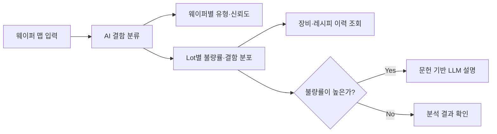
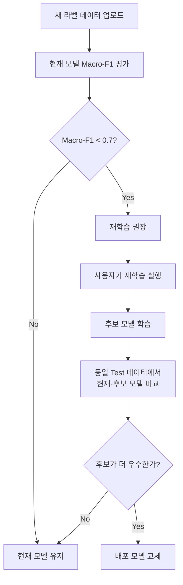
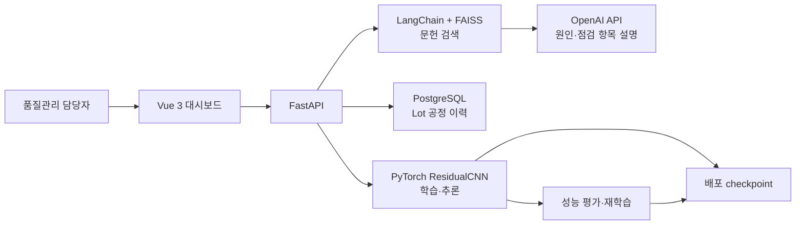
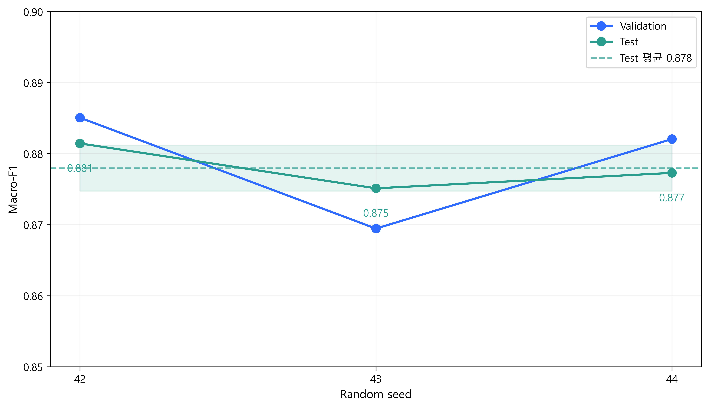

# WaferGuard

> **반도체 웨이퍼 품질 관리 AI 서비스**

WaferGuard는 반도체 제조 과정에서 생성되는 **웨이퍼 맵을 AI로 분석해 결함 유형을 분류하고, Lot 단위의 품질 현황과 공정 이력을 함께 확인할 수 있도록 만든 서비스**입니다.

## 한눈에 보기

| 구분 | 내용 |
|---|---|
| 서비스 대상 | 반도체 제조사 품질관리팀 |
| 프로젝트 기간 | 2025.09.10 ~ 2025.10.10 |
| 프로젝트 인원 | 3인 — Backend·Data Science 1명 / Full-stack 1명 / Frontend 1명 |
| 해결 과제 | 웨이퍼 불량 분류, Lot 품질 현황 파악, 모델 성능 유지, 불량 원인 탐색 |
| 핵심 기능 | 9-class 결함 분류, Lot 통계·공정 이력, 모델 평가·재학습, 문헌 기반 LLM 설명 |
| 데이터 | WM-811K 중 라벨이 존재하는 웨이퍼 맵 172,950개 |
| 모델 성능 | Test Accuracy 97.7%, Macro-F1 0.8780 ± 0.0032 |
| Data Science | Python, PyTorch, scikit-learn, pandas, NumPy, OpenCV |
| Backend | FastAPI, Pydantic, PostgreSQL, LangChain, FAISS, OpenAI API |
| Frontend | Vue 3, Vite, Axios, Chart.js, Bootstrap |
| 프로젝트 성과 | SKALA MLOps mini-project 1위, SKALA 2기 우수 프로젝트 선정 |

> [!NOTE]
> **전혜민(본인) 담당 영역**  
> 데이터 분석·모델링, FastAPI Backend, 모델 평가·재학습 파이프라인, LLM/RAG

## 프로젝트 배경과 문제 정의

웨이퍼는 반도체 칩이 만들어지는 원형 기판입니다. 제조 공정이 끝나면 각 칩의 검사 결과를 위치별로 표시한 **웨이퍼 맵**이 생성됩니다. 웨이퍼 맵에 나타나는 결함의 모양과 위치는 공정 이상을 추적하는 단서가 됩니다.

이 프로젝트에서는 품질관리 업무와 관련된 네 가지 과제를 정의하고 서비스 기능으로 연결했습니다.

| 품질관리 과제 | 프로젝트에서 정의한 문제 | 구현한 대응 |
|---|---|---|
| 반복적인 육안검사에는 시간과 인력이 필요하고 작업자에 따라 판단이 달라질 수 있음 | 웨이퍼의 정상 여부뿐 아니라 결함 유형까지 빠르게 구분해야 함 | Vision AI가 정상과 8개 불량 유형을 자동 분류하고 신뢰도를 제공 |
| 웨이퍼 규격·장비·공정 조건이 달라지면 기존 모델의 성능이 낮아질 수 있음 | 배포 이후에도 새 데이터로 모델 성능을 확인하고 갱신할 방법이 필요함 | 라벨 데이터로 현재 모델을 평가하고, 필요하면 재학습한 후보와 비교해 더 나은 모델만 승격 |
| Lot별 불량 현황과 공정 이력이 분리되어 있으면 원인 탐색에 시간이 걸림 | 결함 결과와 장비·레시피 이력을 한 흐름에서 확인해야 함 | Lot별 결함 통계와 PostgreSQL의 공정 이력을 함께 제공 |
| 비숙련자는 결함 유형을 확인해도 원인과 점검 순서를 정하기 어려움 | 분석 결과를 실제 점검 행동으로 연결할 보조 정보가 필요함 | 관련 반도체 문헌을 검색해 LLM이 가능한 원인과 우선 점검 항목을 참고문헌과 함께 제안 |

실제 제조 현장의 운영 효과까지 검증한 단계는 아니므로 시간·비용 절감을 정량 성과로 주장하지 않습니다. 본 프로젝트에서는 품질관리 과제를 기능으로 구체화하고, 모델 성능과 전체 서비스 동작을 검증하는 데 집중했습니다.

## 서비스 흐름

### 웨이퍼 품질 분석

품질관리 담당자는 분석 범위에 따라 단일 웨이퍼, 단일 Lot 또는 여러 Lot의 데이터를 입력합니다.

- **단일 웨이퍼:** 한 장의 결함 유형과 예측 신뢰도 확인
- **단일 Lot:** 같은 Lot에 속한 여러 웨이퍼의 불량률과 유형별 분포 확인
- **다중 Lot:** 여러 Lot의 불량률을 비교하고 우선 확인할 Lot 탐색



분류 대상은 `Center`, `Donut`, `Edge-Loc`, `Edge-Ring`, `Loc`, `Random`, `Scratch`, `Near-full`, `none`의 9개 클래스입니다.

AI 분류 결과는 Lot별 정상·불량 수와 결함 유형 분포로 집계됩니다. PostgreSQL의 장비·레시피 이력을 함께 조회하고, 불량률이 높은 Lot에는 관련 논문을 근거로 가능한 원인과 우선 점검 항목을 제공합니다.

### 모델 성능 평가와 재학습

라벨이 있는 새로운 웨이퍼 데이터를 업로드하면 현재 배포 모델의 9-class Macro-F1을 다시 측정합니다.



재학습은 성능이 낮아졌다는 이유만으로 즉시 실행되지 않습니다. 시스템이 재학습 필요 여부를 안내하면 사용자가 실행을 결정하고, 새 후보의 반올림 전 Macro-F1이 기존 모델보다 높을 때만 배포 checkpoint를 교체합니다.

## 시스템 구성과 프로젝트 구조



| 영역 | 역할 | 주요 기술 |
|---|---|---|
| Frontend | 데이터 업로드, 예측 결과와 Lot 통계 시각화, 재학습 요청 | Vue 3, Vite, Axios, Chart.js, Bootstrap |
| Backend API | 요청 검증, 예측·평가·재학습·설명 API 제공 | FastAPI, Pydantic, Uvicorn |
| Modeling | 웨이퍼 전처리, CNN 학습·추론, 성능 평가 | PyTorch, scikit-learn, OpenCV |
| Database | Lot별 공정 장비와 레시피 이력 관리 | PostgreSQL, psycopg2 |
| LLM/RAG | 관련 논문 검색과 원인·점검 항목 설명 | LangChain, FAISS, PyMuPDF, OpenAI API |

```text
MLOps_wafer/
├── modeling/                  # EDA, 비교 실험, 최종 모델 선정
│   ├── compare_experiments.ipynb
│   ├── config.py
│   ├── data.py
│   ├── preprocessing.py
│   ├── models.py
│   ├── training.py
│   ├── evaluation.py
│   ├── docs/                 # 실험 설계·결과 보고서와 시각화
│   └── tests/
├── back/                      # FastAPI 기반 추론·모델 운영 서비스
│   ├── api/routes/           # 예측·재학습·LLM API
│   ├── core/model/           # ResidualCNN, 추론, 재학습
│   ├── core/evaluation/      # 평가지표와 혼동행렬
│   ├── services/             # PostgreSQL과 LLM/RAG
│   ├── model/                # 배포 checkpoint
│   └── tests/
├── front/                     # Vue 기반 품질 관리 대시보드
│   └── src/
│       ├── pages/
│       └── components/
├── README.md
└── .gitignore
```

## 모델링 결과

모델 구조, 학습 방법, 입력 전처리를 순차적으로 비교해 최종적으로 `ResidualCNN + 종횡비 유지 Resize/Pad + Cross Entropy + 증강 없음`을 선택했습니다. 최종 설정을 확정하기 전까지 Test 데이터는 모델 선택에 사용하지 않았습니다.

| 지표 | 결과 |
|---|---:|
| Validation Macro-F1 | 0.8582 → **0.8851** |
| Test Accuracy | 97.64% ± 0.03%p |
| Test Macro-F1 | **0.8780 ± 0.0032** |
| Test 최저 클래스 F1 | 0.7840 ± 0.0061 |



실험 가설, 평가 지표 선정, 모델·학습법·전처리 비교와 클래스별 오류 분석은 아래 문서에서 확인할 수 있습니다.

- [모델링 개요와 재현 방법](modeling/README.md)
- [전체 실험 결과 보고서](modeling/docs/wafer_defect_classification_result.md)
- [실험 설계와 비교 조건](modeling/docs/experiment_design.md)
- [Colab 실험 노트북](modeling/compare_experiments.ipynb)

## 팀 구성과 역할

기획과 서비스 아키텍처는 세 팀원이 함께 논의했으며, 구현은 아래와 같이 분담했습니다.

> [!IMPORTANT]
> **저장소 안내**  
> 프로젝트 진행 당시에는 GitHub를 협업 도구로 사용하지 않았으며, 프로젝트 종료 후 전혜민이 팀 산출물을 통합해 이 저장소에 업로드했습니다. 따라서 현재 Git 커밋 이력은 프로젝트 당시의 작업 순서나 팀원별 기여를 그대로 나타내지 않습니다. 실제 기여 범위는 아래 역할 분담을 기준으로 정리했습니다.

### 전혜민(본인) — Backend·Data Science / MLOps

- 프로젝트 기획 및 서비스 아키텍처 설계
- 데이터 탐색, 전처리와 CNN 비교 실험
- 최종 모델 선정과 학습·추론 파이프라인 구축
- FastAPI 라우팅, 서비스 계층 및 PostgreSQL 연동
- 새 데이터 평가, 재학습, 기존·후보 모델 비교와 모델 승격 구현
- OpenAI API와 문헌 검색을 활용한 LLM 응답 모듈 개발

### 김정윤 — Full-stack

- 프로젝트 기획 및 서비스 아키텍처 설계
- Vue 기반 모델 관리 화면 구현
- Lot·Factory 관련 FastAPI API 설계 및 구현
- 모델 학습·추론 결과 시각화와 프런트엔드 API 연동
- 프런트엔드 UI/UX 및 상태 관리 개선

### 김유진 — Frontend / UI 설계

- 프로젝트 기획 및 서비스 아키텍처 설계
- 서비스 와이어프레임 설계
- Vue 기반 Image·Lot·Factory 화면 구현
- 이미지 및 공정 분석 API 연동

모델링 실험과 학습·추론 파이프라인은 [`modeling/`](modeling/README.md), 모델 평가·재학습·LLM/RAG를 포함한 서비스 구현은 [`back/`](back/README.md)에서 자세히 확인할 수 있습니다. [`front/`](front/README.md)는 팀원들이 구현한 통합 서비스 화면입니다.

## 실행 방법

### 요구 환경

- Python 3.10 이상, 3.11 권장
- PostgreSQL 13 이상
- Node.js 18 이상
- LLM 기능 사용 시 OpenAI API 키

### Backend

```powershell
cd back
python -m venv .venv
.\.venv\Scripts\Activate.ps1
pip install -r requirements.txt
Copy-Item .env.example .env
python create_db.py
python -m scripts.build_paper_index
python -m uvicorn main:app --host 0.0.0.0 --port 8001 --reload
```

> `create_db.py`는 `.env`의 `DB_NAME`과 같은 데이터베이스가 존재하면 삭제하고 다시 생성합니다. 보존해야 하는 데이터베이스 이름을 사용하지 마세요.

서버가 실행되면 `http://localhost:8001/docs`에서 Swagger UI를 확인할 수 있습니다.

### Frontend

```powershell
cd front
npm install
npm run dev
```

브라우저에서 `http://localhost:5173`으로 접속합니다. 자세한 환경변수, API, 테스트 방법은 [Backend 문서](back/README.md)를 참고해 주세요.

## 데이터셋

모델링에는 [WM-811K Wafer Map 데이터셋](https://www.kaggle.com/datasets/qingyi/wm811k-wafer-map/data)을 사용했습니다. 원본 811,457개 중 결함 라벨이 있는 172,950개를 학습과 평가에 사용했습니다.

원본 데이터는 용량과 라이선스를 고려해 저장소에 포함하지 않았습니다. 모델링을 재현하려면 `LSWMD.pkl`을 별도로 내려받아 Colab 프로젝트의 `data/` 디렉터리에 배치해야 합니다.

## 한계와 다음 과제

- 실제 반도체 제조 현장에서 업무 시간이나 비용 절감 효과를 검증하지는 못했습니다.
- `Near-full` 등 희소 클래스는 Test 표본도 적어 추가 데이터 검증이 필요합니다.
- `Scratch`, `Loc`, `Edge-Loc` 결함이 정상으로 분류되는 오류를 우선 줄여야 합니다.
- 현재 재학습은 성능 저하를 안내한 뒤 사용자가 실행하는 방식입니다. 자동 실행에는 운영 정책과 승인 절차가 추가로 필요합니다.
- 데이터 분포 변화 감지, 장기 성능 모니터링, 다중 서버의 모델 버전 관리는 추가 구현 과제입니다.
- LLM 설명은 검색 문헌에 기반한 참고 정보이므로 전문가 검토 없이 공정 원인을 확정하는 용도로 사용할 수 없습니다.

## 상세 문서

| 문서 | 내용 |
|---|---|
| [Modeling README](modeling/README.md) | 문제 정의, 실험 과정, 최종 결과, 재현 방법 |
| [실험 결과 보고서](modeling/docs/wafer_defect_classification_result.md) | 그래프, 클래스별 성능, 혼동행렬, 한계 |
| [실험 설계](modeling/docs/experiment_design.md) | 단계별 비교 조건과 특징 정의 |
| [Backend README](back/README.md) | API, 추론, 재학습, 모델 승격, LLM/RAG |
| [Frontend README](front/README.md) | 화면 기능과 실행 방법 |
