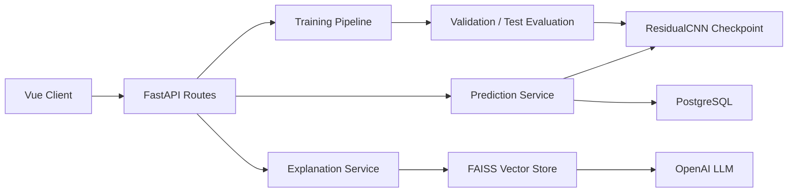
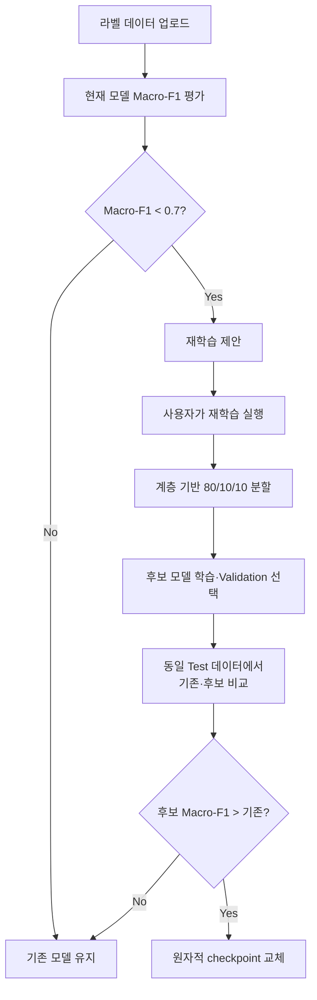

# WaferGuard Backend

> 반도체 웨이퍼 품질 관리 AI 서비스의 추론·모델 운영 백엔드

FastAPI로 웨이퍼 결함 예측, Lot 단위 통계, PostgreSQL 공정 이력 조회, 라벨 데이터 평가와 재학습, 문헌 검색 기반 LLM 설명 기능을 제공합니다.

## 담당 기능

- 단일 웨이퍼 이미지의 결함 유형과 신뢰도 예측
- 단일 Lot 및 여러 Lot의 결함률·유형별 통계 집계
- PostgreSQL에 저장된 Lot별 장비·레시피 이력 조회
- 새 라벨 데이터에서 현재 배포 모델의 Macro-F1 평가
- 성능 기준 미달 시 재학습 제안 및 사용자 요청 기반 후보 모델 학습
- 기존 모델과 후보 모델의 공정한 비교 및 조건부 checkpoint 승격
- 결함률이 높은 Lot의 문헌 검색 및 LLM 기반 원인·점검 항목 설명

## 시스템 구조



라우터는 요청 검증과 응답 구성을 담당하고, 모델 학습·추론과 DB·LLM 기능은 `core/`와 `services/`로 분리했습니다. CPU·GPU 연산과 동기 DB 작업은 FastAPI의 thread pool에서 실행해 이벤트 루프의 직접적인 블로킹을 줄였습니다.

## 모델 추론 파이프라인

```text
입력 검증
  → 웨이퍼 맵 로드
  → 종횡비 유지 Resize + 중앙 Padding
  → 1×64×64 텐서 생성
  → ResidualCNN 추론
  → 9-class label·confidence 반환
  → Lot별 결함 통계·공정 이력 결합
```

학습과 서비스 간 전처리 차이로 성능이 달라지지 않도록 모델링과 같은 반올림 기반 Resize/Pad를 사용합니다. 모델 로더는 checkpoint에 저장된 다음 계약을 확인하고 불일치하면 로드를 거부합니다.

- 모델명: `residual_cnn`
- 전처리: `resize_pad`
- 입력 채널: 1
- 입력 크기: `64×64`
- 클래스 순서: 8개 불량 유형과 `none`

metadata가 없는 raw state dict나 알 수 없는 모델·전처리, 뒤바뀐 클래스 순서는 서비스에 반영되지 않습니다.

## 모델 평가·재학습·승격



### 설계 원칙

- **고정된 9개 클래스 평가:** 업로드 데이터에 없는 클래스도 0점으로 포함해 Macro-F1 착시를 방지합니다.
- **재현 가능한 분할:** seed 42와 라벨 계층화를 사용해 Train 80%, Validation 10%, Test 10%로 나눕니다.
- **역할이 다른 Validation과 Test:** 후보 checkpoint 선택은 Validation, 기존·후보의 최종 비교는 동일 Test 데이터로 수행합니다.
- **엄격한 승격 조건:** 반올림 전 후보 Macro-F1이 기존 모델보다 높을 때만 승격합니다. 동점은 기존 모델을 유지합니다.
- **실패 안전성:** 후보 checkpoint를 임시 파일로 복사한 뒤 `os.replace`로 교체합니다. 복사에 실패하면 현재 배포 모델을 보존합니다.

## LLM 기반 설명

결함률이 설정값 이상인 Lot에 대해 결함 유형과 비율을 검색 질의로 구성하고, 반도체 웨이퍼 결함 관련 PDF에서 관련 문서를 검색합니다. 검색 결과를 근거로 LLM이 가능한 원인과 우선 점검 항목을 설명하고 참고문헌 metadata를 함께 반환합니다.

```text
Lot 결함 요약
  → FAISS 유사 문서 검색
  → 검색 문맥과 결함 분포를 prompt에 결합
  → LLM 설명 생성
  → 설명 + 참고문헌 반환
```

- 기본 생성 모델: `gpt-4o-mini`
- 임베딩 모델: `text-embedding-3-small`
- 검색 문서 수: 5
- 설명 생성 기준 불량률: 10%
- 논문 추가 여부를 주기적으로 확인해 vector store 갱신

LLM의 답변은 품질관리 담당자의 판단을 대체하는 확정 진단이 아니라, 관련 문헌을 바탕으로 초기 원인 탐색과 점검 순서를 돕는 참고 정보입니다.

## 주요 API

| Method | Endpoint | 설명 |
|---|---|---|
| `POST` | `/predict_img` | 단일 웨이퍼 예측과 Lot 공정 이력 조회 |
| `POST` | `/predict_multi_images_one_lot` | 단일 Lot ZIP 예측과 결함 통계 |
| `POST` | `/predict_multi_images_multi_lots` | 여러 Lot ZIP 예측과 Lot별 집계 |
| `POST` | `/upload_predict_labeled_images` | 라벨 데이터로 현재 모델 평가 및 재학습 필요 여부 반환 |
| `POST` | `/retrain_predict_labeled_images` | 후보 재학습, 동일 Test 비교, 조건부 모델 승격 |
| `POST` | `/explanation/get_llm_response` | 결함률이 높은 Lot의 문헌 기반 설명 생성 |

## 디렉터리 구조

```text
back/
├── api/
│   ├── routes/               # 예측·재학습·설명 endpoint
│   └── middleware.py
├── config/                   # 환경·경로·DB·모델 설정
├── core/
│   ├── data/                 # PyTorch Dataset
│   ├── evaluation/           # 평가지표와 confusion matrix
│   └── model/                # ResidualCNN, 추론, 재학습
├── model/
│   └── best_model.pth        # 서비스 배포 checkpoint
├── paper/                    # RAG 검색 대상 문헌
├── scripts/
│   └── build_paper_index.py
├── services/
│   ├── db.py                 # PostgreSQL connection pool과 조회
│   └── llm.py                # 문헌 검색과 LLM 응답
├── tests/                    # 모델 계약·재학습·설명 테스트
├── .env.example
├── create_db.py
└── main.py
```

## 로컬 실행

Python 3.10 이상이 필요하며 3.11을 권장합니다.

### 1. 환경 구성

```powershell
cd back
python -m venv .venv
.\.venv\Scripts\Activate.ps1
python -m pip install --upgrade pip
pip install -r requirements.txt
Copy-Item .env.example .env
```

`.env`에 PostgreSQL 접속 정보와 LLM 기능에 사용할 OpenAI API 키를 설정합니다.

### 2. 데이터베이스와 문헌 인덱스 준비

```powershell
python create_db.py
python -m scripts.build_paper_index
```

> `create_db.py`는 설정한 이름과 같은 데이터베이스가 있으면 삭제하고 다시 생성합니다. 보존해야 하는 데이터베이스 이름을 사용하지 마세요.

### 3. 서버 실행

```powershell
python -m uvicorn main:app --host 0.0.0.0 --port 8001 --reload
```

실행 후 `http://localhost:8001/docs`에서 Swagger UI를 확인할 수 있습니다.

## 테스트

`back` 디렉터리에서 다음 명령을 실행합니다.

```powershell
python -m pytest tests -q
```

주요 검증 항목은 다음과 같습니다.

- 학습·추론 Resize/Pad 일치
- 입력값과 checkpoint metadata 계약 검증
- 단일·다중 이미지 추론 반환 형식
- 80/10/10 계층 분할 재현성
- 고정 9-class Macro-F1 계산
- 후보 모델 승격 조건과 동점 처리
- checkpoint 교체 실패 시 기존 모델 보존
- LLM 설명 생성 기준과 응답 형식

## 한계와 다음 과제

- 현재 재학습은 성능 저하를 자동으로 알려주지만 실행은 사용자의 요청으로 시작합니다.
- 업로드 파일의 크기 제한, 인증·인가, 비동기 작업 큐는 운영 환경에 맞춰 보강해야 합니다.
- 단일 서버의 메모리에서 모델을 사용하므로 다중 worker 배포 시 모델 버전 동기화가 필요합니다.
- 데이터 분포 변화 감지와 운영 지표 모니터링은 별도 체계가 필요합니다.
- LLM 설명은 전문가 검토가 필요한 참고 정보이며 실제 공정 원인을 확정하지 않습니다.

