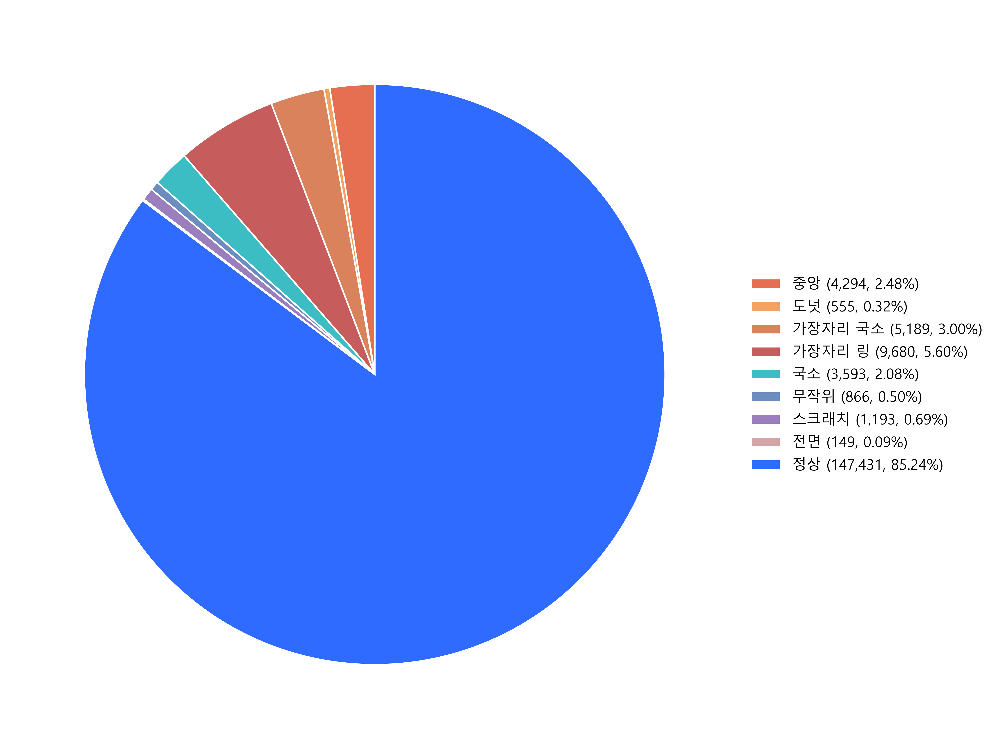
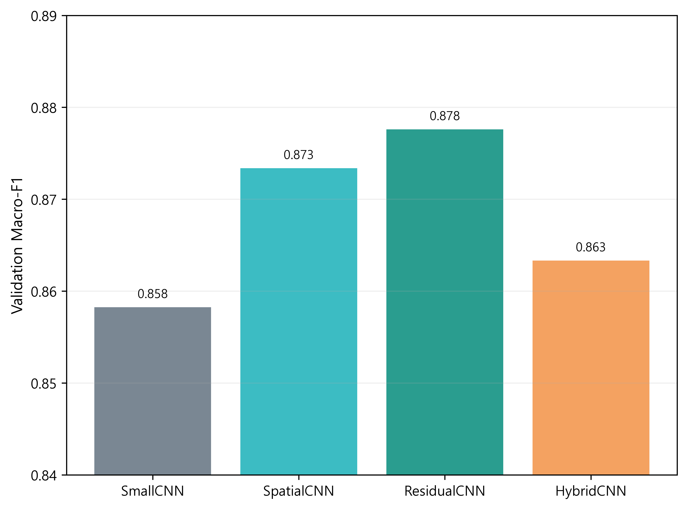
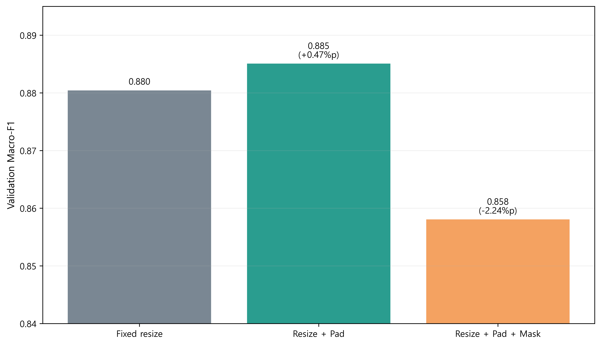
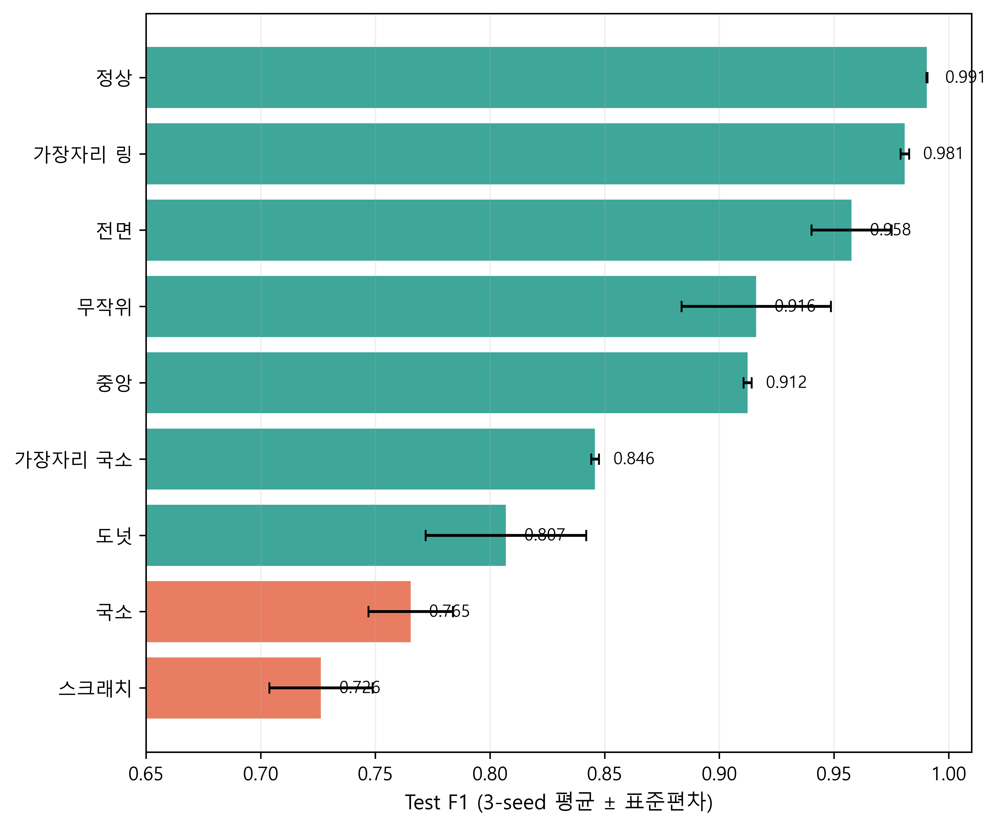

# WaferGuard Modeling

> 반도체 웨이퍼 품질 관리 AI 서비스의 9-class 결함 분류 모델링

WM-811K 웨이퍼 맵을 `Center`, `Donut`, `Edge-Loc`, `Edge-Ring`, `Loc`, `Random`, `Scratch`, `Near-full`, `none`으로 분류합니다. 모델 구조, 학습 방법, 입력 전처리를 단계적으로 비교하고 독립 Test 데이터와 3개 seed로 최종 성능을 확인했습니다.

## 결과 요약

- 사용 데이터: 라벨이 존재하는 웨이퍼 맵 **172,950개**
- 주요 평가 지표: **Macro-F1**
- 최종 구성: **ResidualCNN + Resize/Pad + Cross Entropy + 증강 없음**
- Validation Macro-F1: **0.8582 → 0.8851** (`+2.68%p`)
- Test Accuracy: **97.64% ± 0.03%p**
- Test Macro-F1: **0.8780 ± 0.0032** (seed 42·43·44)

상세 수치와 해석은 [실험 결과 보고서](docs/wafer_defect_classification_result.md), 실험 조건은 [실험 설계 문서](docs/experiment_design.md)에서 확인할 수 있습니다.

## 문제 정의

웨이퍼 맵은 0·1·2 값으로 이루어진 2차원 배열이지만, 결함의 위치와 공간적 형태에 따라 유형이 나뉩니다. 품질관리팀의 육안분류 부담을 줄이려면 정상 여부만 판별하는 것이 아니라 후속 원인 탐색에 활용할 수 있도록 **정상과 8개 불량 유형을 구분하는 다중분류**가 필요합니다.

모델링에서는 두 가지 데이터 특성을 우선 확인했습니다.

1. `none`이 전체의 **85.24%**를 차지하는 클래스 불균형
2. 원본 크기 조합이 346개이고 **86.76%가 비정사각형**인 입력 형상 편차



모든 샘플을 정상으로 예측해도 Accuracy가 높게 보일 수 있으므로 Accuracy 대신 9개 클래스의 성능을 동일 비중으로 반영하는 Macro-F1을 주요 선택 지표로 사용했습니다. 입력 크기를 맞출 때는 결함 형태가 찌그러지지 않도록 종횡비 보존 여부를 실험 대상으로 두었습니다.

## 실험 설계


전체 조합을 모두 탐색하지 않고 다음 세 단계를 순차 실행했습니다.

| 단계 | 비교한 조건 | 선택 기준 |
|---|---|---|
| 모델 구조 | SmallCNN, SpatialCNN, ResidualCNN, HybridCNN | Validation Macro-F1 |
| 학습 방법 | CE/Weighted CE × 증강 적용 여부 | Validation Macro-F1 |
| 입력 전처리 | Fixed resize, Resize+Pad, Resize+Pad+Mask | Validation Macro-F1 |

동점이면 최저 클래스 F1, 그다음 모델 파라미터 수를 고려합니다. 각 단계의 우승 조건을 다음 단계로 전달하고, 모든 설정을 확정한 후에만 Test 데이터를 평가했습니다.

### 평가 원칙

- 라벨 기준 계층 분할로 Train·Validation·Test의 클래스 비율 유지
- 학습과 모델 선택에는 Train·Validation만 사용
- Test 결과를 보기 전에 Validation 성능으로 배포 후보 seed 고정
- 최종 설정을 seed 42·43·44로 반복해 초기화에 따른 변동 확인
- Accuracy뿐 아니라 Macro-F1, 최저 클래스 F1, 클래스별 Precision·Recall·F1 확인

## 실험 결과

### 1. 모델 구조

| 모델 | Validation Macro-F1 | 최저 클래스 F1 |
|---|---:|---:|
| SmallCNN | 0.8582 | 0.7109 |
| SpatialCNN | 0.8611 | 0.7202 |
| ResidualCNN | **0.8795** | **0.7853** |
| HybridCNN | 0.8713 | 0.7385 |



ResidualCNN이 Macro-F1과 최저 클래스 F1에서 가장 높았습니다. 수작업으로 만든 24개 형상 특징을 결합한 HybridCNN은 파라미터가 더 많았지만 ResidualCNN을 넘지 못했습니다.

### 2. 손실 함수와 증강

| 손실 함수 / 증강 | Validation Macro-F1 | 최저 클래스 F1 |
|---|---:|---:|
| CE / 없음 | **0.8795** | **0.7853** |
| CE / 적용 | 0.8736 | 0.7511 |
| Weighted CE / 없음 | 0.8703 | 0.7487 |
| Weighted CE / 적용 | 0.8674 | 0.7326 |

불균형을 고려한 가중 손실과 회전·반전 증강이 반드시 성능을 높일 것이라는 가설은 실험에서 확인되지 않았습니다. 기본 Cross Entropy와 증강 없는 조건을 선택했습니다.

### 3. 입력 전처리

| 입력 전처리 | Validation Macro-F1 | 최저 클래스 F1 |
|---|---:|---:|
| Fixed resize | 0.8795 | 0.7853 |
| Resize + Pad | **0.8851** | **0.8031** |
| Resize + Pad + Mask | 0.8667 | 0.7273 |



종횡비를 유지한 Resize+Pad가 Fixed resize보다 Macro-F1을 `0.56%p` 높였습니다. 반면 유효 영역 mask를 두 번째 채널로 추가하면 성능이 하락해, 더 많은 입력 정보가 항상 성능 개선으로 이어지는 것은 아니었습니다.

## 최종 평가

최종 설정은 `ResidualCNN + Resize/Pad + CE + 증강 없음`입니다.


| 지표 | 3-seed Test 결과 |
|---|---:|
| Accuracy | 97.64% ± 0.03%p |
| Macro-F1 | **0.8780 ± 0.0032** |
| 최저 클래스 F1 | 0.7840 ± 0.0061 |

Macro-F1의 seed 표준편차가 `0.0032`로 작아 초기화가 달라져도 전체 성능은 유사했습니다. Accuracy와 Macro-F1의 차이가 약 `9.84%p`라는 점은 불균형 데이터에서 Accuracy만으로 모델을 평가하면 안 되는 이유를 다시 보여줍니다.

## 오류 분석



- `Loc`, `Donut`, `Scratch`의 F1이 상대적으로 낮습니다.
- `Scratch`의 24.6%, `Loc`의 16.3%, `Edge-Loc`의 13.9%가 정상으로 분류됐습니다.
- `Near-full`은 높은 점수를 기록했지만 seed당 Test 표본이 15개이므로 일반화 성능을 단정하기 어렵습니다.
- 운영 관점에서는 결함을 정상으로 놓치는 오류를 우선 줄여야 합니다.

## 재현 방법

### Colab

1. `modeling` 폴더를 Google Drive의 `MyDrive/Colab Notebooks/SKALA/wafer_v2/modeling`에 복사합니다.
2. `data/LSWMD.pkl`에 WM-811K 원본 데이터를 둡니다.
3. [`compare_experiments.ipynb`](compare_experiments.ipynb)를 Colab GPU 런타임에서 실행합니다.
4. 환경·데이터, 모델 구조, 학습 방법, 전처리, 최종 검증 셀을 순서대로 실행합니다.

### CLI

프로젝트 루트에서 다음 명령을 실행합니다.

```bash
python -m modeling.run_experiment --stage models
python -m modeling.run_experiment --stage recipes
python -m modeling.run_experiment --stage preprocessing
python -m modeling.run_experiment --stage final
```

`python -m modeling.run_experiment --stage all`로 네 단계를 순서대로 실행할 수도 있습니다. 동일한 설정·데이터 분할·소스 해시와 완전한 산출물이 확인되면 완료된 실험을 재사용합니다.

## 실험 산출물

각 실험에는 다음 파일이 저장됩니다.

- `config.json`: 모델·학습·전처리 설정
- `metrics.json`: Validation 평가 결과
- `history.csv`: epoch별 Train·Validation 지표
- `predictions.csv`: Validation 예측 결과
- `confusion_matrix.png`: Validation 혼동행렬
- `model.pth`: 모델 가중치와 설정 metadata
- `train.log`, `status.json`: 학습 로그와 진행 상태
- `test_metrics.json`, `test_predictions.csv`: 최종 평가 실험의 Test 결과

`suites/<ID>/final_summary.json`에는 3개 seed의 평균과 표본 표준편차가 저장됩니다. `deployment_selection.json`에는 Test 확인 전에 Validation으로 선택한 배포 후보가 기록됩니다.

## 한계와 다음 과제

- 단계별 실험으로 계산 비용을 줄였지만 조건 간 모든 상호작용을 탐색하지는 못했습니다.
- 희소 클래스는 Test 표본도 적어 추가 데이터와 반복 검증이 필요합니다.
- `Scratch`, `Loc`, `Edge-Loc`의 정상 오분류를 줄이기 위한 hard example 분석이 필요합니다.
- 클래스별 비용이 다른 실제 운영 환경에서는 Macro-F1과 함께 비용 기반 지표와 임계값을 설계해야 합니다.
- 데이터 분포 변화를 감지하는 모니터링과 자동 재학습 실행 정책은 추가 검증이 필요합니다.

## 주요 파일

| 파일 | 역할 |
|---|---|
| [`compare_experiments.ipynb`](compare_experiments.ipynb) | Colab 실험 실행과 결과 확인 |
| [`config.py`](config.py) | 실험 설정과 후보 정의 |
| [`data.py`](data.py) | 데이터 로드와 분할 |
| [`preprocessing.py`](preprocessing.py) | 입력 전처리 |
| [`models.py`](models.py) | 비교 모델 구조 |
| [`training.py`](training.py) | 학습과 checkpoint 저장 |
| [`evaluation.py`](evaluation.py) | 지표와 결과 조회 |
| [`run_experiment.py`](run_experiment.py) | 단계별 실험 실행 CLI |

