# 웨이퍼 결함 패턴 분류 성능 개선 포트폴리오

> **한 줄 요약**  정상 데이터가 85.24%인 불균형 환경에서 정확도 착시를 피하고, 모델·학습법·전처리를 순차 검증해 validation Macro-F1을 **0.8582에서 0.8851로 2.68%p 개선**했다. 최종 설정은 독립 test에서 **Macro-F1 0.8780 ± 0.0032**를 기록했다.

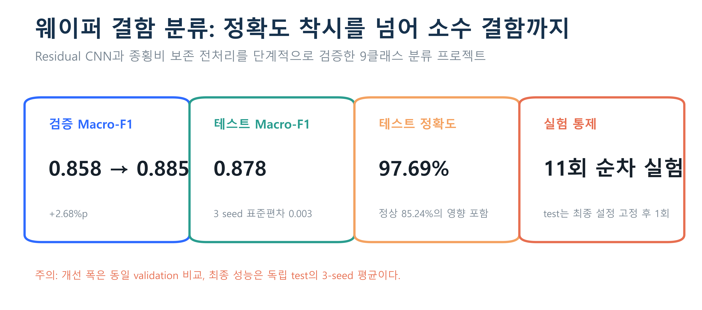

## 1. 이해관계자와 페인포인트

### 프로젝트 배경

반도체 생산 과정에서 웨이퍼 맵의 결함 패턴은 공정 이상을 추적하는 단서다. 그러나 대량의 웨이퍼를 사람이 일관되게 분류하기 어렵고, 정상 샘플이 압도적으로 많아 단순 정확도만으로는 희귀 결함의 누락을 확인하기 어렵다. 이 프로젝트의 목표는 웨이퍼 맵을 9개 패턴으로 자동 분류하면서, 후보 모델을 재현 가능한 기준으로 선택하고 소수 클래스의 위험을 운영 의사결정에 연결하는 것이다.

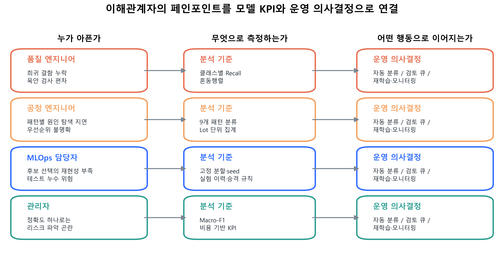

| 이해관계자 | 페인포인트 | 필요한 분석 결과 | 연결할 의사결정 |
|---|---|---|---|
| 품질 엔지니어 | 희귀 결함 누락, 육안 판정 편차 | 클래스별 Recall, 혼동행렬 | 자동 판정 범위와 검토 큐 우선순위 |
| 공정 엔지니어 | 패턴별 원인 탐색과 대응 지연 | 9개 결함 패턴, Lot별 예측 집계 | 공정 점검 순서와 원인 분석 대상 |
| MLOps 담당자 | 후보 선택의 재현성 부족, test 누수 위험 | 고정 분할, seed, 실험 이력 | 모델 승격·재학습·모니터링 |
| 관리자 | 높은 정확도가 실제 결함 대응력을 가리는 문제 | Macro-F1, Recall, 업무량·비용 KPI | 자동화 범위와 투자 우선순위 |

### 분석 질문과 성공 기준

1. 공간 구조를 더 보존하거나 잔차 연결을 사용하면 소수 결함을 포함한 평균 성능이 좋아지는가?
2. 클래스 가중 손실과 회전·반전 증강이 실제 validation 성능을 높이는가?
3. 원본 종횡비를 보존하는 전처리가 단순 정사각 리사이즈보다 유리한가?
4. 선택한 전략이 모델 초기화 seed가 달라도 안정적인가?

1차 성공 지표는 9개 클래스를 동일하게 반영하는 **Macro-F1**이다. 동률일 때는 최저 클래스 F1, 파라미터 수 순으로 선택한다. Accuracy와 weighted 지표는 운영 규모를 이해하는 보조 지표로 사용한다.

## 2. 데이터 EDA

### 데이터 범위

- 원본: `data/LSWMD.pkl`, 총 811,457행
- 라벨 데이터: 172,950행(21.31%)
- 라벨이 비어 분석에서 제외된 데이터: 638,507행(78.69%)
- 클래스: Center, Donut, Edge-Loc, Edge-Ring, Loc, Random, Scratch, Near-full, none
- 웨이퍼 맵 값: 영역 밖 `0`, 정상 셀 `1`, 불량 셀 `2`
- 라벨 데이터의 고유 Lot: 10,762개

### 핵심 발견 1 — 클래스 불균형

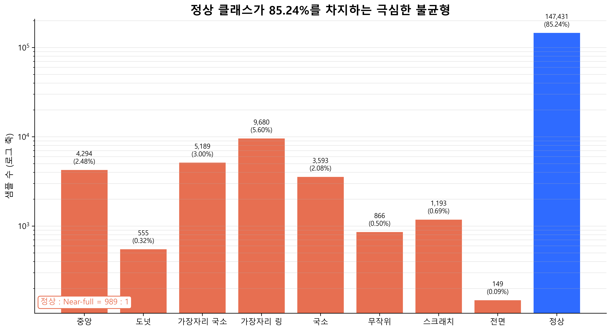

정상 클래스 `none`은 147,431개로 전체 라벨 데이터의 85.24%다. 반면 가장 적은 `Near-full`은 149개(0.086%)뿐이며 정상과 약 989:1 차이가 난다. 모든 샘플을 정상으로 예측해도 Accuracy가 높게 보일 수 있으므로, 모델 선택 지표를 Accuracy가 아닌 Macro-F1로 두었다.

| 클래스 | 샘플 수 | 비율 |
|---|---:|---:|
| Center | 4,294 | 2.48% |
| Donut | 555 | 0.32% |
| Edge-Loc | 5,189 | 3.00% |
| Edge-Ring | 9,680 | 5.60% |
| Loc | 3,593 | 2.08% |
| Random | 866 | 0.50% |
| Scratch | 1,193 | 0.69% |
| Near-full | 149 | 0.09% |
| none | 147,431 | 85.24% |

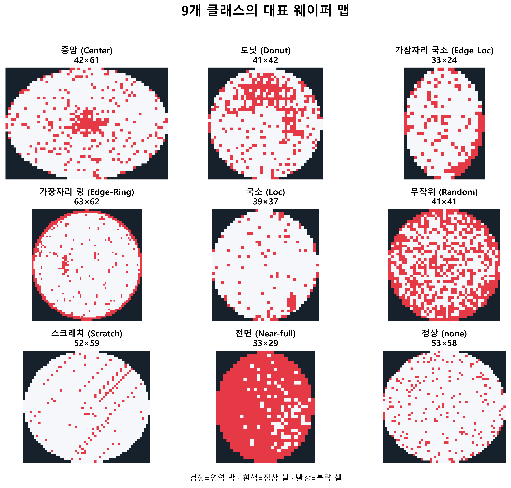

### 핵심 발견 2 — 입력 형상이 일정하지 않음

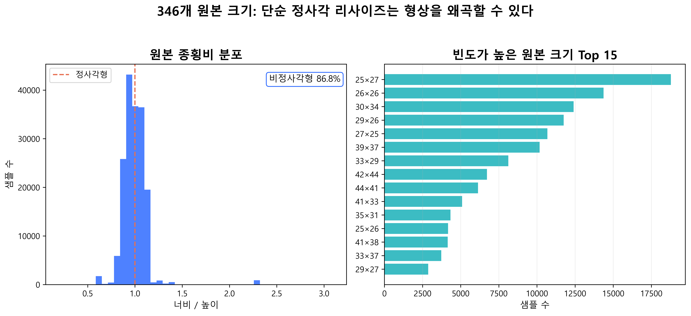

원본 맵에는 346개 크기 조합이 존재한다. 높이는 15~212, 너비는 3~204 범위이며 중앙값은 각각 33이다. 비정사각형 맵이 86.76%이므로 모든 입력을 바로 64×64로 늘리면 원형과 결함의 방향·위치 관계가 왜곡될 수 있다. 이 발견을 근거로 종횡비 보존 패딩을 독립 실험 후보에 포함했다.

### 데이터 분할

전체 라벨 데이터를 셔플·층화해 train 138,360개(80%), validation 17,295개(10%), test 17,295개(10%)로 고정했다. 분할 seed는 42이며 원본 행 번호와 데이터 지문을 manifest로 저장했다. 후보 선택에는 validation만 사용하고 test는 최종 설정을 잠근 뒤 평가했다.

중요한 한계도 있다. 현재 분할은 웨이퍼 행 단위이며 Lot 그룹 분할이 아니다. train/validation 중복 Lot은 6,790개, train/test 중복 Lot은 6,795개, 세 분할 모두에 존재하는 Lot은 5,947개다. 따라서 결과를 **새로운 Lot에 대한 일반화 성능**으로 해석할 수는 없다.

## 3. 데이터 전처리

### 공통 정제

1. 중첩 배열 형태의 `failureType`을 단일 문자열로 변환한다.
2. 빈 라벨은 제거하지만 `none`은 정상 클래스이므로 유지한다.
3. 클래스 순서를 고정하고 정수 `label_id`로 매핑한다.
4. 맵이 2차원이며 `0/1/2`로만 구성되고 유효 셀이 있는지 검증한다.
5. 최근접 보간을 사용해 범주 값이 중간값으로 섞이지 않도록 한다.

### 비교한 전처리

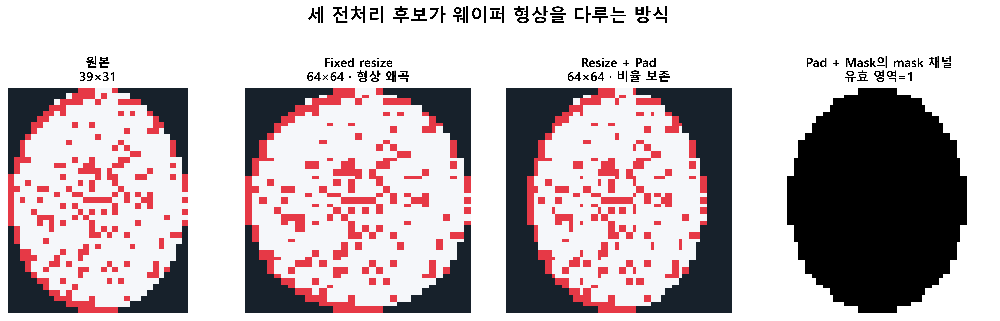

| 방식 | 처리 | 입력 채널 | 가설 |
|---|---|---:|---|
| Fixed resize | 종횡비를 무시하고 64×64 변환 | 1 | 단순하지만 형상 왜곡 가능 |
| Resize + Pad | 긴 변을 64로 맞추고 중앙 zero padding | 1 | 결함 위치와 형상 비율 보존 |
| Resize + Pad + Mask | Pad 결과에 유효 셀 mask 추가 | 2 | 모델이 웨이퍼 경계를 명시적으로 인식 |

맵 채널은 `0~2` 값을 `2`로 나눠 `0~1`로 인코딩한다. mask 채널은 영역 밖 `0`, 유효 영역 `1`이다. 증강 후보는 train에만 수평·수직 반전과 ±15도 회전을 온라인으로 적용했으며 validation과 test에는 적용하지 않았다.

## 4. 모델링

### 실험 전략

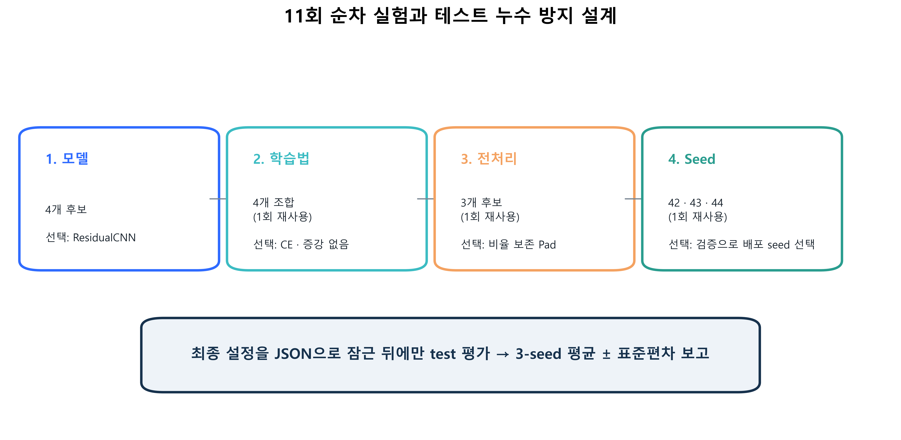

전역 조합을 모두 탐색하는 대신, 모델 → 학습법 → 전처리 → seed 순으로 우승 조건을 다음 단계에 전달했다. 완료 결과를 재사용해 총 11개의 고유 학습으로 비교했다. 이 방식은 계산 비용과 해석 복잡도를 줄이지만, 단계 간 상호작용을 모두 탐색하지는 못한다.

공통 조건은 Adam, learning rate 0.001, weight decay 0.0001, batch size 32, 최대 30 epoch다. validation Macro-F1 기준 early stopping patience 7과 ReduceLROnPlateau를 사용하고, 최고 validation Macro-F1 checkpoint를 복원했다.

### 1단계 — 모델 구조

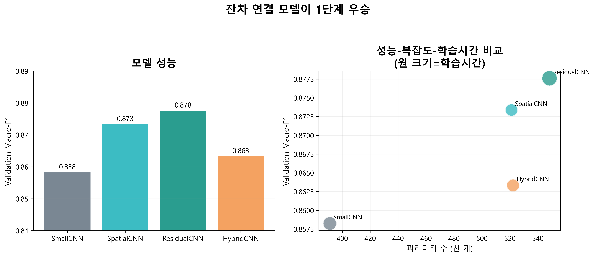

| 모델 | Validation Macro-F1 | 최저 클래스 F1 | 파라미터 |
|---|---:|---:|---:|
| SmallCNN | 0.8582 | 0.7163 | 391,113 |
| SpatialCNN | 0.8734 | 0.7504 | 521,161 |
| **ResidualCNN** | **0.8776** | **0.7732** | 548,361 |
| HybridCNN | 0.8633 | 0.7535 | 522,249 |

ResidualCNN이 Macro-F1과 최저 클래스 F1 모두 가장 높아 우승했다. 반면 이미지 표현에 24개 기하학 특징을 결합한 HybridCNN은 개선되지 않았다. 이 데이터에서는 수작업 특징 추가보다 CNN이 공간 표현을 직접 학습하도록 하는 편이 유리했다.

### 2단계 — 손실 함수와 증강

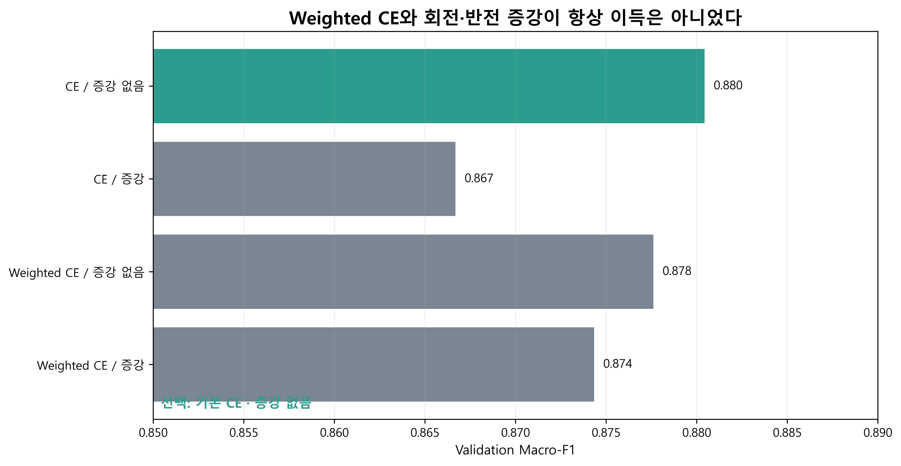

| 손실 / 증강 | Validation Macro-F1 | 최저 클래스 F1 |
|---|---:|---:|
| **CE / 없음** | **0.8804** | 0.7470 |
| CE / 적용 | 0.8667 | 0.7470 |
| Weighted CE / 없음 | 0.8776 | **0.7732** |
| Weighted CE / 적용 | 0.8743 | 0.7518 |

기본 CE와 증강 미사용 조합이 1차 선택 지표인 Macro-F1에서 가장 높았다. 회전·반전 증강은 두 손실 모두에서 성능을 높이지 못했다. 공간 방향이 클래스 의미와 연결되거나 회전 시 경계가 잘리는 특성 때문에, 해당 변환이 완전한 label-preserving augmentation이 아니었을 가능성이 있다. 이는 결과에 기반한 가설이며 별도 ablation으로 확인해야 한다.

### 3단계 — 전처리

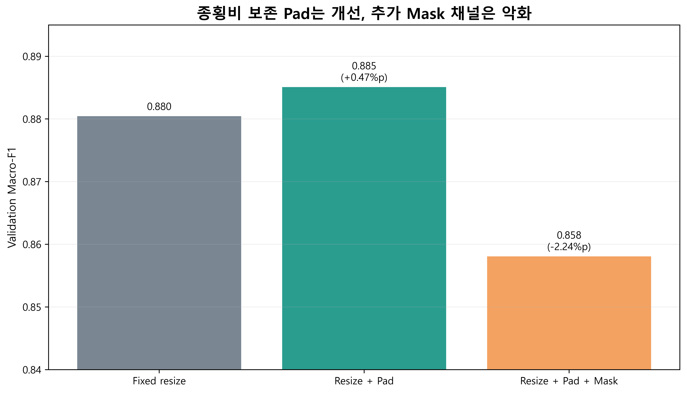

| 전처리 | Validation Macro-F1 | 최저 클래스 F1 |
|---|---:|---:|
| Fixed resize | 0.8804 | 0.7470 |
| **Resize + Pad** | **0.8851** | **0.7681** |
| Resize + Pad + Mask | 0.8581 | 0.7239 |

종횡비 보존 Pad는 Fixed resize 대비 Macro-F1을 0.47%p 높였다. 반면 mask 채널은 2.24%p 낮췄다. 웨이퍼 경계 정보는 기존 맵의 0 값에 이미 포함되어 있어 추가 채널이 중복 신호나 최적화 부담으로 작용했을 수 있다.

### 최종 설정

`ResidualCNN + Resize/Pad + 기본 CE + 증강 없음`을 고정하고 seed 42·43·44로 재학습했다. 배포 후보는 test를 보기 전에 validation Macro-F1이 가장 높은 seed 42로 선택했다.

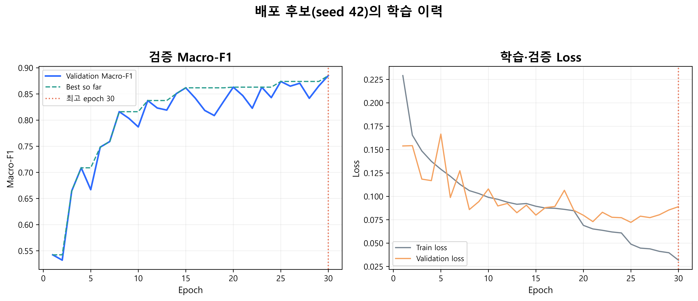

## 5. 평가

### 기준선 대비 개선

동일 validation 분할에서 기준선 `SmallCNN + Fixed resize + Weighted CE`의 Macro-F1은 0.8582, 최종 전략 seed 42는 0.8851이다. 절대 **2.68%p**, 상대 **3.13%** 개선이다. 최저 클래스 F1도 0.7163에서 0.7681로 5.18%p 개선됐다. 이 수치는 후보 선택용 validation 비교이며 test 개선 폭으로 표현하지 않는다.

### 3-seed 독립 test 결과

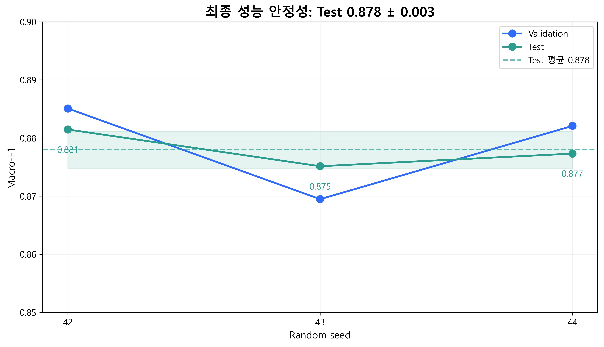

| Seed | Test Accuracy | Test Macro-F1 | Test 최저 클래스 F1 |
|---:|---:|---:|---:|
| 42 | 0.9772 | 0.8815 | 0.7022 |
| 43 | 0.9766 | 0.8751 | 0.7297 |
| 44 | 0.9769 | 0.8773 | 0.7468 |
| **평균** | **0.9769** | **0.8780** | **0.7262** |

- Test Macro-F1: **0.8780 ± 0.0032**(표본 표준편차, ddof=1)
- Test Macro-Precision: 0.8978
- Test Macro-Recall: 0.8619
- Test Weighted-F1: 0.9762
- Test Accuracy: 0.9769

Accuracy와 Macro-F1 사이에 약 9.89%p 차이가 난다. 다수 클래스의 높은 성능이 전체 정확도를 끌어올리지만, 희귀 결함에서는 여전히 개선 여지가 있다는 뜻이다.

### 클래스별 성능

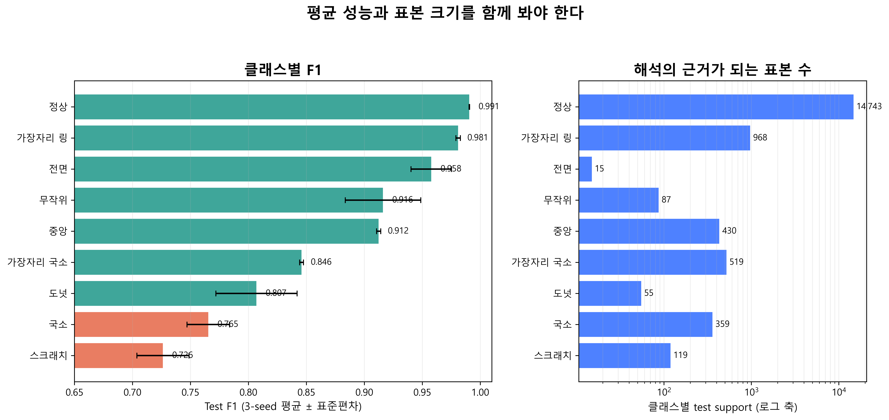

| 클래스 | Test F1 평균 | Test Recall 평균 | Test support/seed | 해석 |
|---|---:|---:|---:|---|
| Center | 0.912 | 0.899 | 430 | 양호, 정상 오분류 감시 |
| Donut | 0.807 | 0.764 | 55 | 소표본이며 Loc 혼동 주의 |
| Edge-Loc | 0.846 | 0.807 | 519 | 정상 오분류 비중이 큼 |
| Edge-Ring | 0.981 | 0.980 | 968 | 안정적인 자동 분류 후보 |
| Loc | 0.765 | 0.713 | 359 | 우선 개선 대상 |
| Random | 0.916 | 0.908 | 87 | 성능은 양호하나 표본 적음 |
| Scratch | 0.726 | 0.692 | 119 | 가장 낮은 F1·Recall |
| Near-full | 0.958 | 1.000 | 15 | 지표는 높지만 근거 표본이 매우 적음 |
| none | 0.991 | 0.995 | 14,743 | 매우 안정적 |

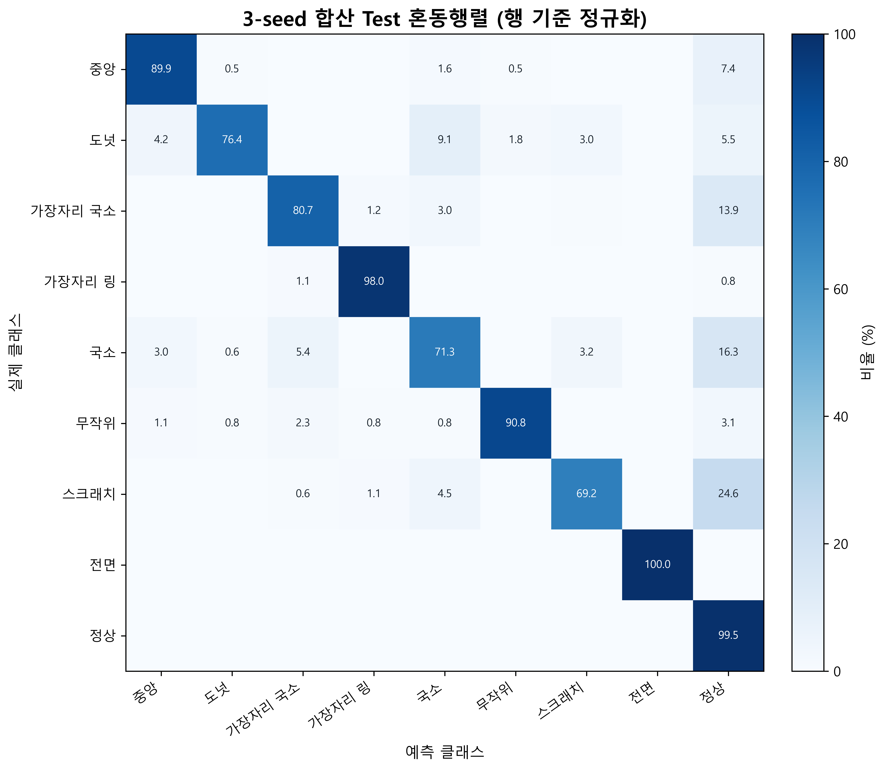

가장 큰 운영 위험은 결함을 정상으로 놓치는 경우다. 3-seed 합산 기준으로 Scratch의 24.6%, Loc의 16.3%, Edge-Loc의 13.9%가 정상으로 예측됐다. Donut은 Loc과의 혼동도 크다. 반면 Near-full의 Recall 1.0은 seed당 test support가 15개뿐이므로 충분한 신뢰의 근거로 보기 어렵다.

## 6. 비즈니스 인사이트와 결론

### 운영에 바로 연결할 수 있는 인사이트

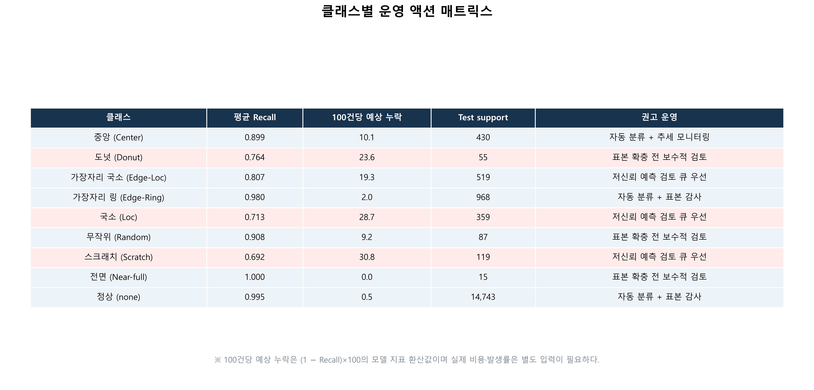

1. **자동화 범위를 클래스별로 다르게 설정해야 한다.** none과 Edge-Ring은 자동 분류 후 표본 감사 방식이 가능하다. Scratch·Loc·Edge-Loc은 저신뢰 예측과 정상 예측 경계 사례를 우선 검토 큐로 보내는 편이 안전하다.
2. **데이터 수집 우선순위는 낮은 Recall과 작은 support의 교집합이다.** Scratch와 Donut을 먼저 보강하고, Near-full은 높은 점수보다 표본 부족을 해결해야 한다.
3. **정확도 대신 결함별 Recall을 운영 KPI로 둬야 한다.** 전체 Accuracy 97.69%만 보면 성능이 충분해 보이지만 Scratch 결함의 평균 누락 가능성은 지표상 30.8%다.
4. **전처리는 모델 구조만큼 중요한 개선 레버다.** 복잡한 mask 채널보다 원본 형상을 보존하는 단순 Pad가 더 효과적이었다. 현장 입력 파이프라인도 학습과 동일한 최근접 보간·중앙 패딩을 사용해야 한다.
5. **증강은 도메인 의미를 검증한 뒤 적용해야 한다.** 일반 이미지에서 유효한 회전·반전이 웨이퍼 위치 패턴에서는 오히려 정보를 훼손할 수 있다.

### 비즈니스 효과를 산정하는 방법

현재 데이터에는 결함별 실제 발생량, 미탐 비용, 재검 비용이 없으므로 금액 효과를 직접 주장하지 않는다. 운영 데이터가 확보되면 다음 식으로 효과를 산정할 수 있다.

```text
예상 미탐 비용 = Σ(클래스별 처리량 × 실제 발생률 × (1 - Recall) × 건당 미탐 손실)
예상 재검 비용 = Σ(클래스별 False Positive 건수 × 건당 검토 비용)
순효과 = 도입 전 품질·검사 비용 - 도입 후 품질·검사 비용 - 모델 운영 비용
```

모델 승격 기준도 단일 Macro-F1이 아니라 `Macro-F1 개선 + 핵심 결함 Recall 하한 + 검토 큐 처리 용량`의 조합으로 설계하는 것이 바람직하다.

### 결론

이 프로젝트의 성과는 단순히 더 깊은 모델을 선택한 데 있지 않다. 불균형을 드러내는 KPI를 정하고, test를 격리한 상태에서 모델·학습법·전처리를 순차 검증했으며, 3개 seed로 최종 성능의 변동성을 확인했다. 그 결과 validation Macro-F1을 2.68%p 높이고 독립 test에서 0.8780 ± 0.0032를 확보했다.

동시에 모델의 한계도 명확하다. Scratch와 Loc의 Recall은 현장 자동 판정에 충분하지 않을 수 있고, Near-full은 평가 표본이 너무 적다. 무엇보다 Lot 중복이 존재하므로 새 Lot 일반화는 아직 검증되지 않았다.

### 다음 단계

1. Lot 기준 Group split 또는 시간 순 holdout으로 일반화 성능을 다시 측정한다.
2. Scratch·Loc·Donut·Near-full 데이터를 우선 수집하고 라벨 품질을 점검한다.
3. 정상으로 오분류된 결함 샘플을 중심으로 hard-example analysis를 수행한다.
4. 확률 calibration과 클래스별 임계값을 검증해 자동 분류·검토 큐 정책을 확정한다.
5. 실제 처리량과 결함별 비용을 연결해 모델 승격 기준과 ROI를 수치화한다.

## 재현성과 산출물

- 실험 suite: `modeling/artifacts/suites/4048895abf6e`
- 최종 설정: `modeling/artifacts/suites/4048895abf6e/final_selection.json`
- 최종 3-seed 결과: `modeling/artifacts/suites/4048895abf6e/final_summary.json`
- 시각화 생성 노트북: `modeling/generate_portfolio_images.ipynb`
- 이미지: `modeling/images/*.png` 15개, 모두 650dpi
- 상세 실험 정의: `modeling/docs/experiment_design.md`

본 문서의 성능 수치는 저장된 JSON/CSV 산출물에서 계산했다. 시각화 노트북은 기존 이미지 덮어쓰기를 기본적으로 막으며, 마지막 셀에서 파일 수와 DPI를 검증한다.
