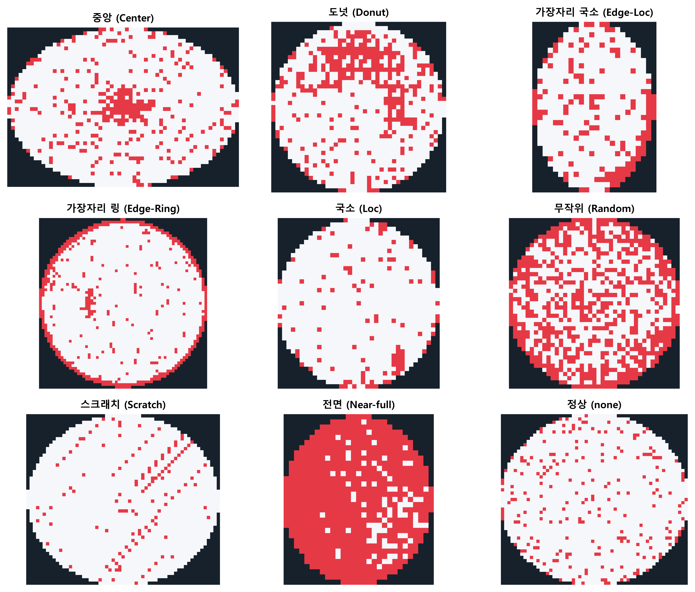
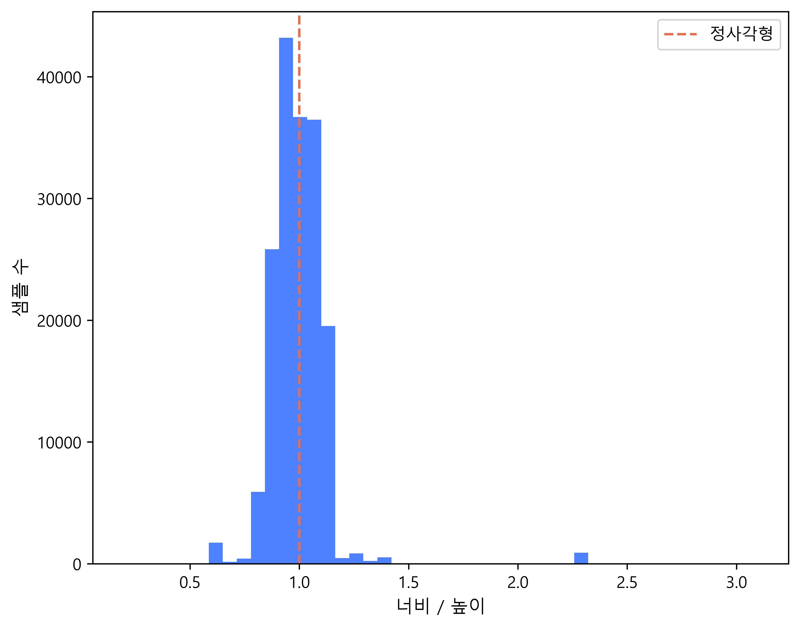
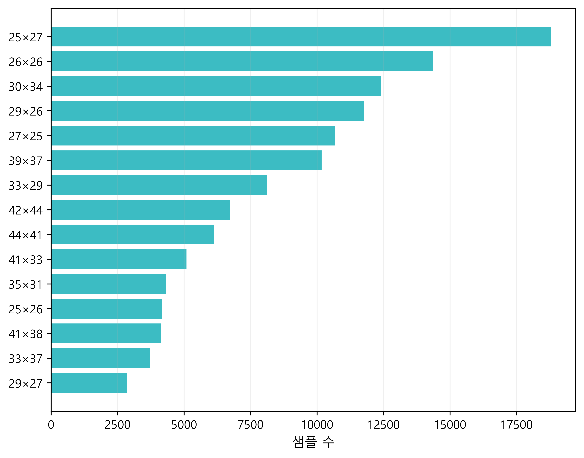
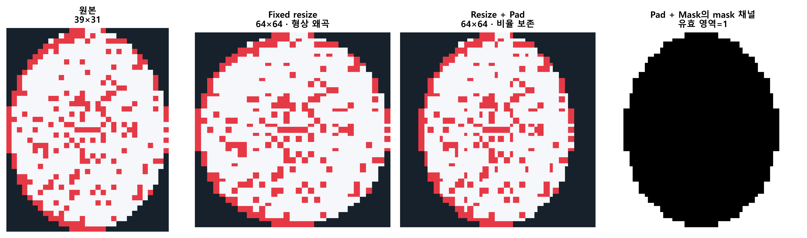
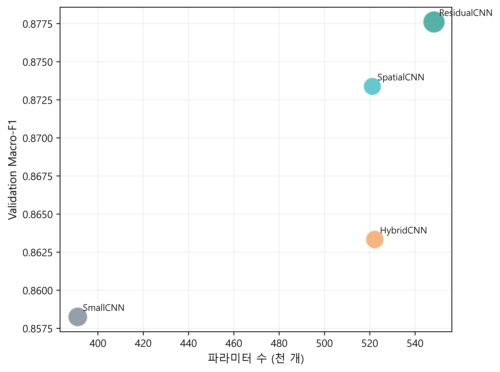
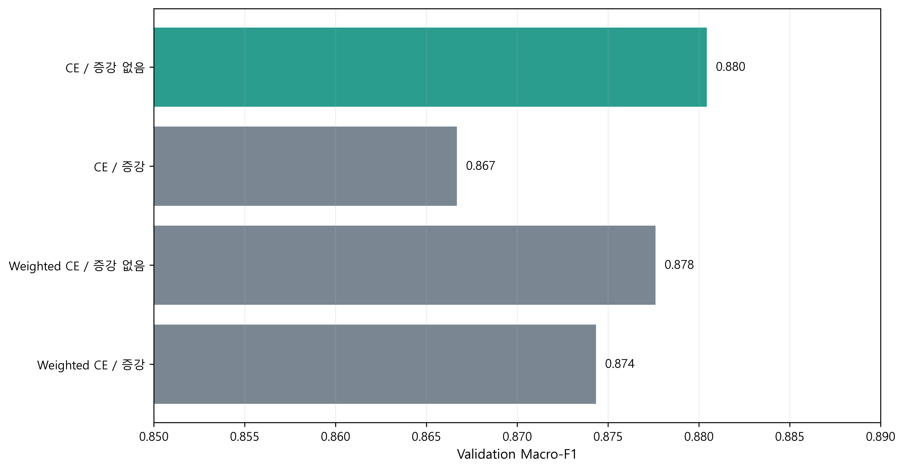
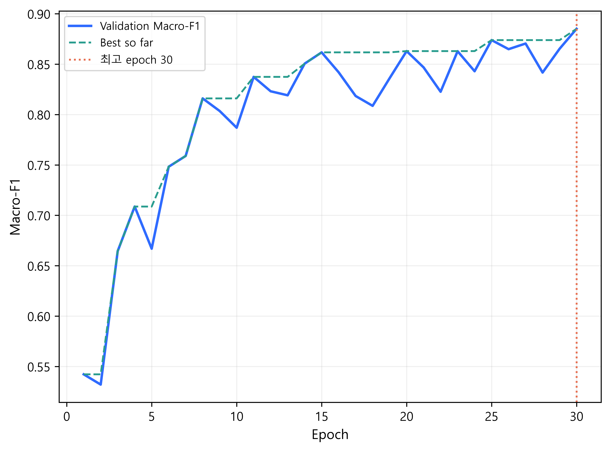
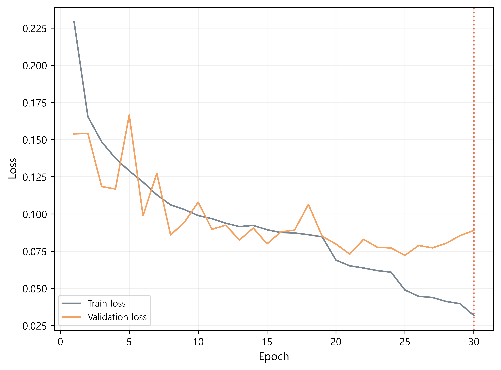
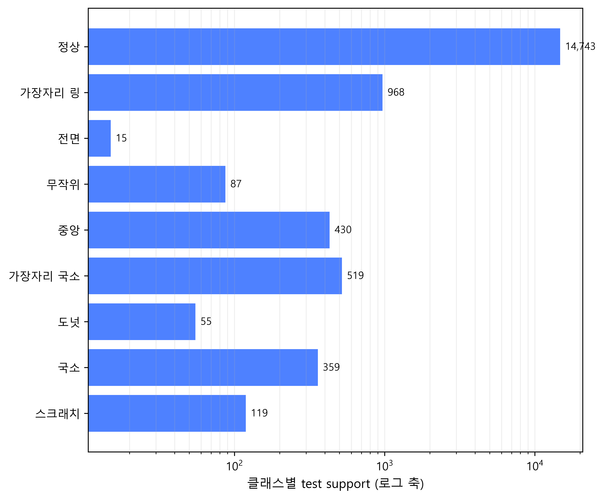
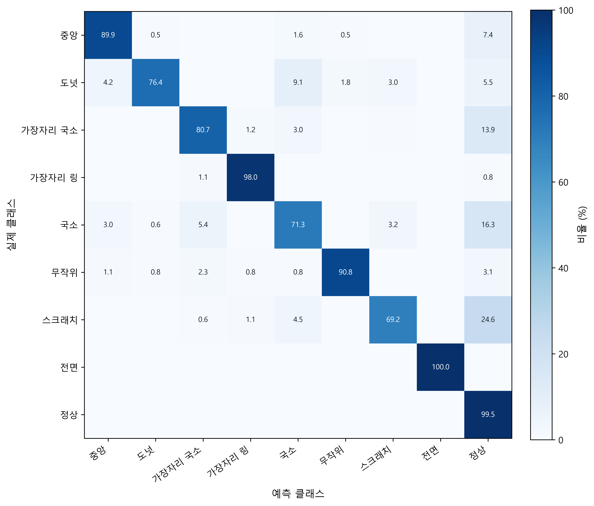

# 웨이퍼 결함 패턴 분류 결과

LSWMD 웨이퍼 맵을 9개 패턴으로 분류했다. 정상 데이터가 대부분인 환경에서 Accuracy만으로 성능을 판단하지 않도록 Macro-F1을 모델 선택 기준으로 사용하고, 모델 구조·학습 방법·전처리를 순차적으로 비교했다.

최종 모델은 validation Macro-F1을 **0.8582에서 0.8851로 2.68%p 개선**했으며, 독립 test에서 3개 seed 평균 **Macro-F1 0.8780 ± 0.0032**를 기록했다.

## 1. 데이터

원본 811,457개 중 결함 라벨이 존재하는 172,950개를 사용했다. 클래스는 `Center`, `Donut`, `Edge-Loc`, `Edge-Ring`, `Loc`, `Random`, `Scratch`, `Near-full`, `none`의 9종이다.

### 클래스 불균형

정상 클래스인 `none`이 147,431개로 전체의 85.24%를 차지한다. 가장 적은 `Near-full`은 149개로, 두 클래스의 표본 수는 약 989배 차이가 난다. 따라서 다수 클래스를 중심으로 계산되는 Accuracy보다 각 클래스의 성능을 동일한 비중으로 반영하는 Macro-F1을 주요 지표로 선택했다.

| 클래스 | 표본 수 | 비율 |
|---|---:|---:|
| Center | 4,294 | 2.48% |
| Donut | 555 | 0.32% |
| Edge-Loc | 5,189 | 3.00% |
| Edge-Ring | 9,680 | 5.60% |
| Loc | 3,593 | 2.08% |
| Random | 866 | 0.50% |
| Scratch | 1,193 | 0.69% |
| Near-full | 149 | 0.09% |
| none | 147,431 | 85.24% |

### 클래스별 웨이퍼 맵

왼쪽 위부터 클래스 표의 순서와 동일하다. 검정은 웨이퍼 영역 밖, 흰색은 정상 셀, 빨강은 불량 셀을 나타낸다. 결함 종류는 불량 셀의 위치와 공간적 패턴으로 구분되며, 원본 웨이퍼 맵의 크기는 일정하지 않다.

### 입력 형상

| 종횡비 분포 | 빈도가 높은 원본 크기 |
|---|---|
|  |  |

원본에는 346개의 크기 조합이 있다. 높이는 15~212, 너비는 3~204이며 중앙값은 모두 33이다. 전체의 86.76%가 비정사각형이므로 64×64 크기로 바로 늘리면 원형과 결함 패턴의 비율이 왜곡될 수 있다.

## 2. 전처리

비교한 전처리 방식은 다음과 같다.

| 방식 | 처리 | 입력 채널 |
|---|---|---:|
| Fixed resize | 원본을 64×64로 직접 변환 | 1 |
| Resize + Pad | 종횡비를 유지해 변환한 뒤 중앙 패딩 | 1 |
| Resize + Pad + Mask | 패딩 결과에 유효 영역 mask 추가 | 2 |

왼쪽부터 원본, Fixed resize, Resize + Pad, Resize + Pad + Mask의 mask 채널이다. 종횡비 보존 패딩은 원본 형상을 유지하면서 모델 입력 크기를 통일한다.

## 3. 실험 설계

모델 구조 → 손실 함수와 증강 → 전처리 → seed 순으로 한 조건씩 비교했다. 각 단계에서 validation Macro-F1이 가장 높은 조건을 다음 단계로 넘겼으며, 최종 설정을 고정한 뒤에만 test 데이터를 평가했다. 전체 조합을 탐색하지 않아 단계 간 상호작용을 모두 확인하지 못한다는 한계가 있지만, 제한된 계산량 안에서 각 변경의 효과를 분리해 해석할 수 있다.

## 4. 모델 선택 결과

### 모델 구조

| 모델별 성능 | 성능과 모델 복잡도 |
|---|---|
|  |  |

| 모델 | Validation Macro-F1 | 최저 클래스 F1 | 파라미터 수 |
|---|---:|---:|---:|
| SmallCNN | 0.8582 | 0.7109 | 38,793 |
| SpatialCNN | 0.8611 | 0.7202 | 41,833 |
| ResidualCNN | **0.8795** | **0.7853** | 174,921 |
| HybridCNN | 0.8713 | 0.7385 | 300,361 |

ResidualCNN이 Macro-F1과 최저 클래스 F1에서 모두 가장 높았다. HybridCNN은 파라미터 수가 더 많지만 성능은 낮아, 복잡도 증가가 성능 향상으로 직접 이어지지 않았다.

### 손실 함수와 증강

| 손실 함수 / 증강 | Validation Macro-F1 | 최저 클래스 F1 |
|---|---:|---:|
| CE / 없음 | **0.8795** | **0.7853** |
| CE / 적용 | 0.8736 | 0.7511 |
| Weighted CE / 없음 | 0.8703 | 0.7487 |
| Weighted CE / 적용 | 0.8674 | 0.7326 |

가중 손실과 회전·반전 증강은 이 실험에서 성능을 개선하지 못했다. 기본 Cross Entropy와 증강 없는 조건을 선택했다.

### 전처리 방식

| 전처리 | Validation Macro-F1 | 최저 클래스 F1 |
|---|---:|---:|
| Fixed resize | 0.8795 | 0.7853 |
| Resize + Pad | **0.8851** | **0.8031** |
| Resize + Pad + Mask | 0.8667 | 0.7273 |

종횡비를 보존한 패딩은 Fixed resize보다 Macro-F1을 0.56%p 개선했다. 반면 mask 채널을 추가한 방식은 성능이 하락했다.

## 5. 최종 평가

최종 설정은 `ResidualCNN + Resize/Pad + 기본 CE + 증강 없음`이다. seed 42·43·44로 학습하고, test 결과를 3개 seed의 평균과 표준편차로 보고했다.

### 학습 이력

| Validation Macro-F1 | 학습 및 검증 loss |
|---|---|
|  |  |

validation Macro-F1과 loss를 함께 추적해 성능 개선과 과적합 여부를 확인했다. 배포 후보는 test 결과를 보기 전에 validation Macro-F1을 기준으로 선택했다.

### Seed 안정성

| Seed | Test Accuracy | Test Macro-F1 | 최저 클래스 F1 |
|---:|---:|---:|---:|
| 42 | 97.67% | 0.8806 | 0.7899 |
| 43 | 97.62% | 0.8743 | 0.7778 |
| 44 | 97.63% | 0.8791 | 0.7844 |
| 평균 ± 표준편차 | 97.64% ± 0.03%p | **0.8780 ± 0.0032** | 0.7840 ± 0.0061 |

seed에 따른 Test Macro-F1 표준편차는 0.0032로 작았다. Accuracy와 Macro-F1의 차이는 약 9.84%p로, 불균형 데이터에서 Accuracy만 보고하면 소수 클래스의 성능을 과대평가할 수 있음을 보여준다.

### 클래스별 성능과 표본 수

| 클래스별 F1 | 클래스별 test 표본 수 |
|---|---|
|  |  |

| 클래스 | Test F1 평균 | Test Recall 평균 | Test support/seed |
|---|---:|---:|---:|
| Center | 0.938 | 0.931 | 429 |
| Donut | 0.784 | 0.835 | 56 |
| Edge-Loc | 0.819 | 0.808 | 519 |
| Edge-Ring | 0.956 | 0.968 | 968 |
| Loc | 0.777 | 0.773 | 359 |
| Random | 0.887 | 0.881 | 87 |
| Scratch | 0.802 | 0.726 | 119 |
| Near-full | 0.958 | 1.000 | 15 |
| none | 0.991 | 0.995 | 14,743 |

`Loc`, `Donut`, `Scratch`의 F1이 상대적으로 낮다. `Near-full`은 점수가 높지만 seed당 test 표본이 15개뿐이므로 성능이 충분히 안정적이라고 단정하기 어렵다.

### 혼동행렬

3개 seed의 test 예측을 합산한 뒤 실제 클래스별 비율로 정규화했다. 주요 운영 위험은 결함을 정상으로 예측하는 경우다. `Scratch`의 24.6%, `Loc`의 16.3%, `Edge-Loc`의 13.9%가 정상으로 분류됐으며, `Donut`은 `Loc`과의 혼동도 상대적으로 크다.

## 6. 결론과 한계

- 종횡비 보존 전처리는 웨이퍼 형상 왜곡을 줄이며 validation Macro-F1을 개선했다.
- 더 복잡한 모델, 가중 손실, 증강, 추가 mask 채널이 항상 성능 향상으로 이어지지는 않았다.
- 전체 성능은 안정적이지만 `Scratch`, `Loc`, `Edge-Loc`의 정상 오분류를 줄이는 작업이 필요하다.
- 희소 클래스는 test 표본도 적으므로 추가 데이터 확보와 반복 평가가 필요하다.
- 단계적 실험은 계산 비용을 줄였지만 조건 간 상호작용을 모두 탐색하지 못했다.

실험 설정과 지표는 `modeling/artifacts`에 저장된 결과를 기준으로 계산했다. 실험의 상세 정의는 [experiment_design.md](experiment_design.md), 이미지 생성 코드는 [generate_portfolio_images.ipynb](generate_portfolio_images.ipynb)에서 확인할 수 있다.
